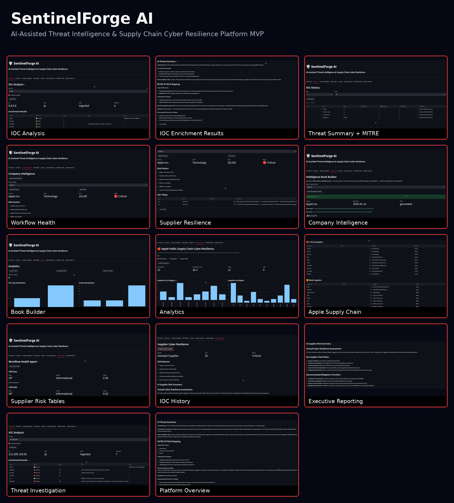
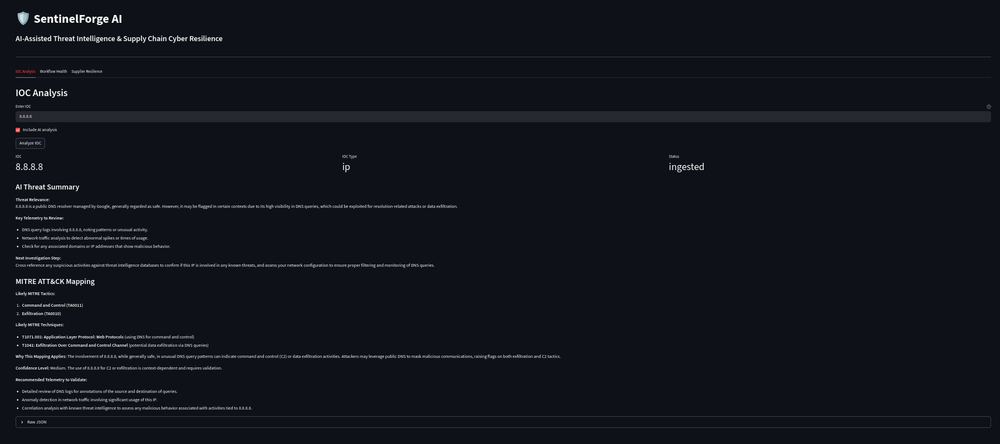
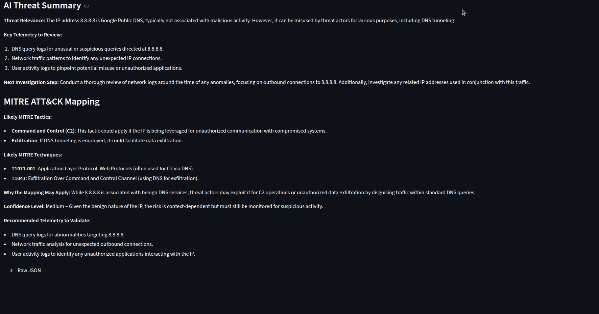
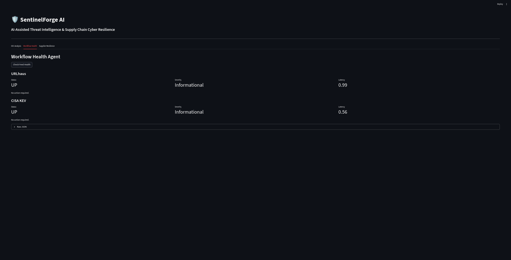
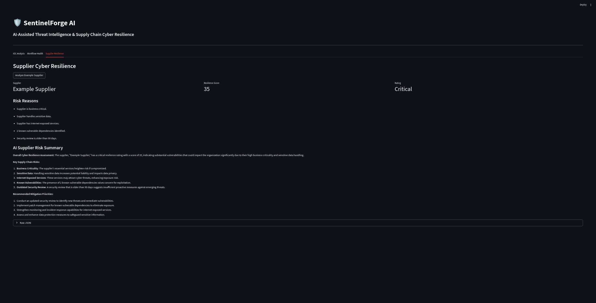
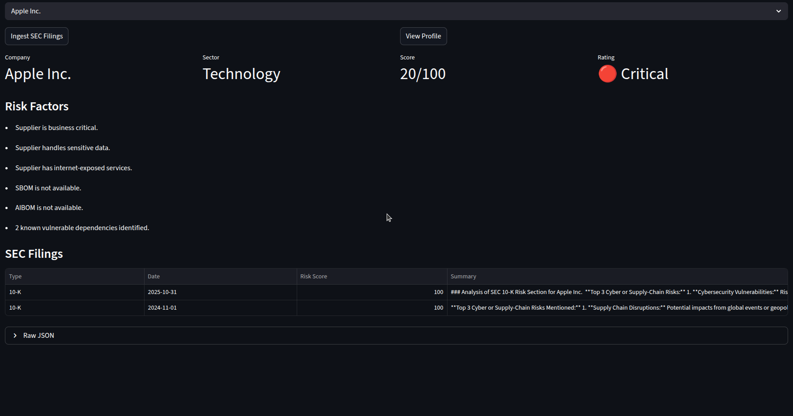
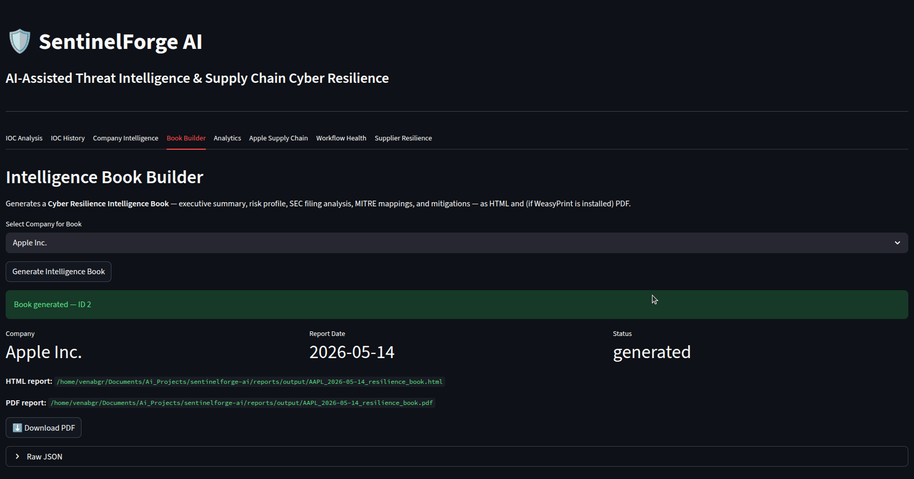
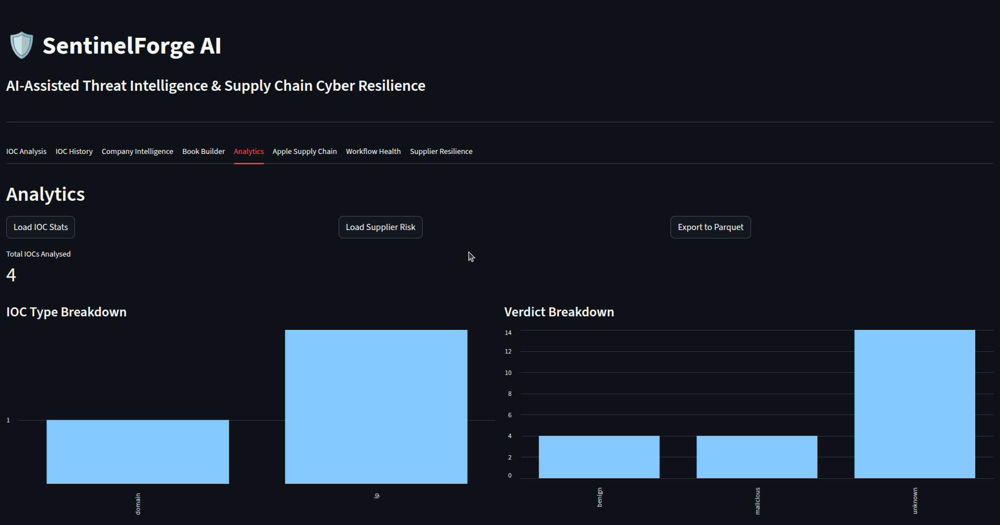
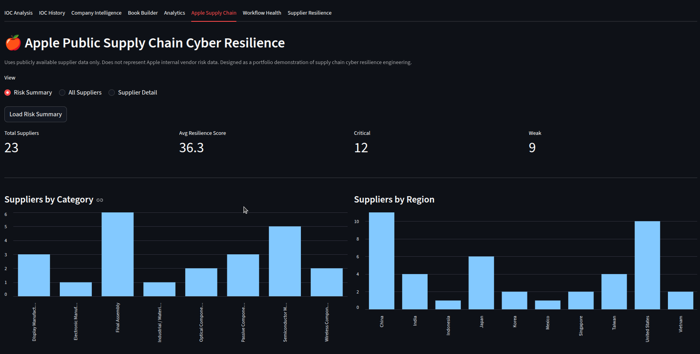

# SentinelForge AI

AI-Assisted Threat Intelligence & Supply Chain Cyber Resilience Platform

SentinelForge AI is a cyber threat intelligence and supply chain cyber resilience platform designed to combine IOC enrichment, AI-assisted threat analysis, operational monitoring, supplier cyber risk scoring, and executive intelligence reporting into a unified analyst workflow.

---

# Platform Overview

---

# Core Capabilities

- IOC enrichment and threat intelligence correlation
- MITRE ATT&CK tactic and technique mapping
- AI-generated threat summaries and investigative guidance
- Threat feed operational health monitoring
- Supplier cyber resilience scoring
- Executive intelligence report generation
- SEC filing cyber risk analysis
- Apple public supply chain cyber resilience modeling
- Historical IOC analytics and persistence
- Exportable reporting and dashboards

---

# IOC Analysis

### Features

- Multi-source IOC enrichment
- AI-generated threat summaries
- MITRE ATT&CK mapping
- Threat scoring and telemetry recommendations
- Operational analyst workflow support

### Integrated Intelligence Sources

- AbuseIPDB
- GreyNoise
- VirusTotal
- AlienVault OTX
- ASN Intelligence
- Shodan (planned expansion)

---

# IOC Enrichment Results

### Features

- Correlated enrichment scoring
- Multi-source intelligence aggregation
- Threat verdict normalization
- IOC tagging and contextual metadata
- Analyst-focused investigation workflow

---

# Workflow Health Monitoring

### Features

- Threat feed health validation
- Feed uptime monitoring
- Latency tracking
- Operational telemetry visibility
- Workflow reliability monitoring

### Current Feed Monitoring

- URLhaus
- CISA KEV

---

# Supplier Cyber Resilience

### Features

- Supplier cyber resilience scoring
- Risk factor analysis
- AI-generated supply chain risk summaries
- Vulnerability exposure analysis
- Business criticality evaluation

### Current Risk Factors

- Business criticality
- Sensitive data handling
- Internet-exposed services
- Known vulnerable dependencies
- Security review age
- SBOM/AIBOM availability

---

# Company Intelligence

### Features

- Company cyber risk profiling
- SEC filing intelligence analysis
- Executive cyber resilience scoring
- Risk factor extraction
- Supply chain exposure analysis

### Current Intelligence Capabilities

- Company profiling
- Cyber resilience scoring
- AI-generated summaries
- Filing ingestion pipeline
- Risk categorization

---

# Intelligence Book Builder

### Features

- Executive intelligence report generation
- HTML intelligence book exports
- PDF intelligence report exports
- AI-assisted executive summaries
- Supply chain resilience reporting

### Generated Reporting Sections

- Executive summary
- Risk profile analysis
- MITRE ATT&CK mapping
- SEC filing analysis
- Recommended mitigations
- Supplier exposure overview

---

# Analytics Dashboard

### Features

- IOC history persistence
- Threat verdict analytics
- IOC trend analysis
- Risk distribution visualization
- Exportable analytics workflows

### Analytics Capabilities

- IOC type breakdowns
- Verdict distribution
- Historical enrichment tracking
- Supplier risk analytics
- Export to Parquet

---

# Apple Public Supply Chain Cyber Resilience

### Features

- Public supplier ecosystem modeling
- Supplier resilience scoring
- Geographic supplier exposure analysis
- Category-based risk visualization
- Executive supply chain dashboards

### Current Supplier Categories

- Semiconductor Manufacturing
- Final Assembly
- Display Manufacturing
- Wireless Components
- Passive Components
- Electronic Manufacturing Services

### Current Geographic Analysis

- China
- Taiwan
- United States
- Japan
- Korea
- Vietnam
- India
- Singapore
- Mexico
- Indonesia

---

# Architecture

## Current Stack

- FastAPI
- Streamlit
- SQLite
- Python
- Multi-source Threat Intelligence APIs

---

# Database Design

SentinelForge AI uses a persistence-first architecture designed to support:

- Historical IOC analysis
- Trend analytics
- Executive dashboards
- Heatmaps and visualizations
- Power BI integration
- Grafana integration
- Long-term intelligence correlation

### Current Storage

- SQLite database
- Historical IOC persistence
- Supplier intelligence storage
- Enrichment result tracking

### Planned Expansion

- PostgreSQL migration
- Background task processing
- Distributed enrichment workflows
- Scalable analytics pipeline

---

# Roadmap

## Threat Intelligence Expansion

- MISP integration
- STIX/TAXII ingestion
- Threat actor clustering
- IOC relationship graphing
- Malware family correlation
- Threat feed confidence scoring

## Advanced Analytics

- Geographic threat heatmaps
- IOC trend visualization
- Executive Power BI dashboards
- Grafana operational dashboards
- Detection engineering metrics
- Interactive analytics visualizations

## Supply Chain Intelligence

- Expanded Apple supplier ecosystem mapping
- Third-party risk scoring
- Supplier dependency graph analysis
- Software supply chain intelligence
- SBOM/AIBOM ingestion
- Vulnerability exposure mapping

## AI & Automation

- Automated intelligence book generation
- Natural language investigation workflows
- AI-assisted prioritization
- Executive summary automation
- AI-driven anomaly detection
- Automated MITRE ATT&CK correlation

## Platform Engineering

- PostgreSQL migration
- REST API expansion
- Role-based authentication
- Containerized deployment
- Kubernetes support
- CI/CD automation
- Background worker architecture

## Enterprise Features

- Multi-tenant architecture
- SOC investigation workspace
- Analyst case management
- Alert triage workflows
- SIEM/SOAR integrations
- Detection engineering workflows

---

# Status

Current Phase: MVP / Active Development

SentinelForge AI is currently focused on building a scalable cyber resilience intelligence platform combining:

- Threat Intelligence
- AI-assisted analysis
- Supply chain cyber resilience
- Executive reporting
- Operational monitoring
- Historical analytics

---

# Disclaimer

Apple supply chain analysis uses publicly available supplier and SEC filing information only.

This project does not represent internal Apple vendor risk data or non-public corporate intelligence.

---

# Author

GV

Cyber Threat Intelligence | Security Operations | Supply Chain Cyber Resilience | AI-Assisted Security Engineering
